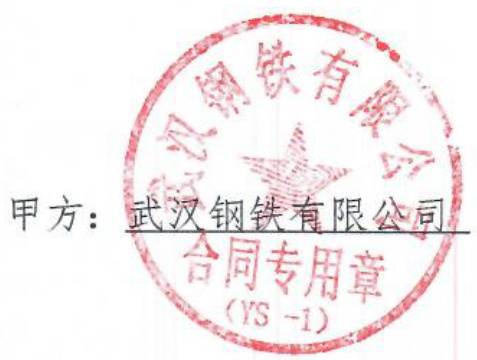
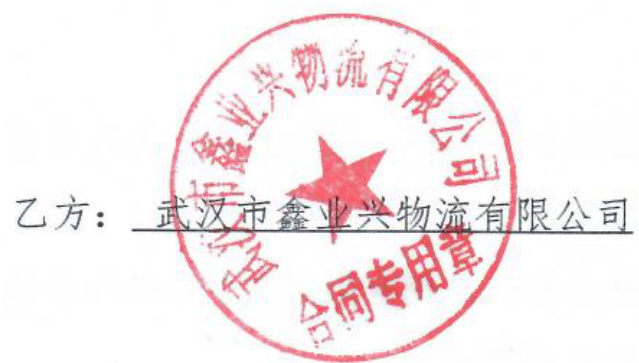
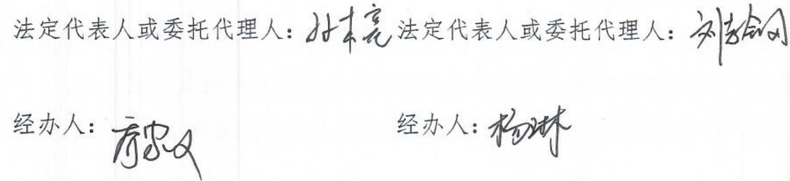

# 武钢有限硅钢氧化铁粉运输合同  

甲方：武汉钢铁有限公司乙方：武汉市鑫业兴物流有限公司  

依照《中华人民共和国民法典》及相关的法律法规，遵循平等、自愿、公平、诚信、合作共赢的原则，甲乙双方在协商一致的基础上，签订本合同。  

第一条业务内容及要求：  

1、业务内容：  

1.1硅钢部一硅钢、三硅钢产生的氧化铁粉运输至炼铁厂六高炉混配中心或均质化料场对应区域；  

1.2需配备30吨带盖翻斗车及20吨平板进行运输作业，年运量约1.45万 吨。  

1.3项目需白班作业，全年无休。  

2、业务要求：  

2.1乙方必须配备符合以上作业需求的车辆满足生产需求，配置的机动车、非道路移动机械必须符合长流程钢铁企业超低排A级绩效企业标准要求，不得因各种原因延误正常生产。  

2.2乙方需服从甲方及相关方的指挥，满足生产所需及环保作业、清洁运输要求，不得因各种原因延误正常保产。  

第二条 运输安全、环保等要求  

1、乙方人员进入厂区或有关仓库作业，必须遵守工厂和有关仓库方的规章管理制度，乙方在作业过程中由于违反厂区和有关仓库方的安全管理制度而发生的一切安全事故均由乙方承担全部责任。  

2、乙方在装载、运输、卸载的作业过程中，应严格遵公司公司关于安全、环保、治安保卫、防火、道路、交通管理中的各类规章制度及要求。  

第三条 运输费用及结算方式：  

1、费用（不含税）：  

1.1氧化铁粉运输：19.68元／吨；  

1.2项目总费用上限按52.3万元（大写：伍拾贰万叁仟圆整）核定。  

2、结算方式  

2.1甲乙双方每月结算一次，按实际运量据实结算。同时，乙方须接受以下事项：  

2.1.1在甲方资金紧张时，甲方可延迟1-2个月支付费用。  

2.1.2结算时，乙方应向甲方开具运输费用的专用增值税发票及附件，甲方自收到乙方提交发票及附件后对其进行核对，核对无异议后向财务报支。  

2.2在合同期末结算时，若结算实绩超过合同约定控制总额，则需业务部门出具情况说明后再签订补充合同。  

第四条甲乙双方的权利义务  

# 一、甲方的权利义务  

1、甲方负责协调用车单位提前发出运输指令，相关方提供相应运输物料装、卸车或作业条件，保证货物符合规定或约定的运输标准。  

2、甲方有权对乙方违反公司和运输部各种运输管理规定的行为进行考核，考核费用从甲方支付给乙方的费用中核减。  

3、甲方有权对乙方的上岗人员在生产操作过程中的安全、生产、设备、质量、环保等方面的工作进行检查、监管、考核并根据检查情况提出意见。  

4、甲方及客户单位有权要求乙方更换不称职的驾驶员及频繁出现故障造成保产障碍的车辆，有权要求车辆完成指令任务。  

5、甲方单位遇体制机构变动或生产工艺的调整，有权根据实际情况通知乙方相应调整服务车辆及相应的岗位人数，但需提前一个月通知乙方。  

6、由甲方组织相关部门对乙方生产协力保产运输服务工作及管理进行随机检查和季度评估。  

# 二、乙方的权利义务  

1、乙方有权向托运方收取运输费用。  

2、乙方应充分了解甲方和装载方、卸货方的所需保产要求，自行配置符合运输需求的车辆，制定实施业务保产运输、作业方案。  

3、乙方负责上述业务范围内的保产运输工作，遵从政府及武钢有限公司及相关方的相关道路交通规章制度运输作业，严格按照相关方的调度指令组织生产，并对上述业务范围的服务质量、环保质量负责；  

4、乙方在作业过程中，须严格遵守甲方关于安全、环保、治安保卫、防火、道路交通等管理中的各类规章制度及要求，作业过程中由于违反相关规定而发生的一切安全事故由乙方承担相应责任；  

5、乙方项目从业人员必须严格遵守甲方及相关方现场管理各项规定，做到车辆、人员作业有序、现场实行定置管理；  

6、乙方负责接收协力支撑或出向人员，并遵照国家用工规定的法律法规，向甲方及相关方提供作业人员及保产车辆等信息，负责对作业人员确认劳动关系、稳定人员队伍，并负责为该项目的作业人员购买《安全生产责任险》。如因上述人员、车辆纠纷引发涉及甲方的纠纷及法律责任，由乙方负责解决并承担相应责任，且不得延误正常生产。  

7、乙方保产人员安全与劳动保护由乙方按照国家及企业相关的管理规定与制度执行；  

8、需要获取完成运输任务相关凭证的，由乙方人员向客户方及相关单位获取相应凭证后交给甲方，获取的凭证需符合甲方要求；  

9、乙方负责上述业务范围内与政府行业管理部门的沟通协调；  

10、如出现武钢有限公司及相关方对上述业务范围内的各类专业管理考核，由乙方承担考核费用；  

11、乙方承担上述业务范围内涉及甲方的交通事故、环保事故和伤害事故的推定过错责任和由此产生的一切费用。  

12、乙方应设一名专职负责人，且配备不少于2名专业技术人员。专职负责人必须具有5年以上相关道路运输管理经验，具备人力资源管理、安全消防管理、设备管理、质量管理、现场管理等专业管理知识，并具有良好的沟通协调能力；专业技术人员中必须有1人具有安全管理资质；  

13、如果政府部门和武钢有限公司要求上述业务范围内的运输车辆需加装环保装置或其他要求的设备设施，其费用由乙方承担；  

14、乙方必须保证运输车辆技术性能良好，尤其是符合车辆环保作业要求；作业时需做到“三清五不漏”，严禁“超载、超高、超宽、超速”，并在国家规定的车辆审验有效期内，严禁“黄标车”上路运行，必须保证货物装载牢靠，防漏撒、扬尘、货损、货差，运至指定地点、区域卸料；  

15、乙方必须按甲方要求统一所有设备上的业主标示，运行和作业必须符合政府及武钢有限公司的各项环保要求，每月对所有运行设备确保不低于两次整体清洁，保证车容车貌及运输作业符合相关环保、运输作业规定要求，经营服务范围内所产生的固、危废类物品须合规处置；  

16、甲方配合协调客户单位提前发出运输指令，相关方提供相应运输物料装、卸车或作业条件，保证货物符合规定或约定的运输标准。  

17、为提升运输效率，必须安装信息化对应装置，费用由乙方承担。需做好运输实绩统计、报送。  

18、乙方必须保证装有卫星定位设备的运输车辆信息传输的畅通，在运输过程中若发生故障必须及时通知甲方和客户单位。  

19、乙方有权拒绝甲方及相关方的违章指挥和违章作业，对不能保证安全生产的作业环境、设备、设施和条件的，有权停止作业。  

20、乙方在作业现场因相关方原因造成损失的，由责任相关方负责进行赔偿。  

21、乙方必须建立健全安全生产、环保等管理体系，自主开展相关工作，定期接受甲方监察，并纳入协力供应商的综合评价管理。  

22、乙方为车辆所办保险必须达到甲方要求，保险含：车损险、不计免赔险，第三者责任险不低于100万元。  

第五条 违约责任  

1、未经甲方允许，乙方擅自更改运输线路和运输时间，造成重大服务质量异议，并给甲方带来严重的负面影响，甲方有权提前终止协议。  

2、因乙方未执行甲方关于安全、生产、设备、质量、环保等相关规章制度，对甲方生产造成重大影响及财产损失或造成重大事故，或给甲方造成严重负面影响、出现特大交通责任事故，甲方有权对乙方进行处罚及进行经济追偿，同时甲方有权终止本合同；  

3、乙方未按时完成工作任务及其他公司有关管理规定，每次扣1000一5000元。若因乙方责任造成重大事故，对甲方生产造成重大影响和财产损失，除对乙方处罚外，还追究其经济责任并赔偿。  

4、在保产范围内，当乙方出现没能执行甲方及客户单位关于安全、生产、设备、质量、环保等重大事故处理所制订的整改措施现象时，甲方有权无条件终止解除本合同。  

5、乙方在运输作业过程中，因违背《武钢有限协力供应商安全管理标准》（WB-16-024），达到及超过“禁入”标准的时，甲方有权提前终止合同；且乙方需在甲方形成新供应商正常保产之前做好过渡期保产工作。  

6、因乙方违反《武钢有限协力供应商安全违约计分抵扣标准》（WB-16-037），甲方按《运输部协力供应商评价办法》对乙方进行评价时其年度评价低于C级，未达到运输部合格供应商要求时，甲方有权提前终止合同；且乙方需做好过渡期保产工作。  

7、在符合法律和合同规定条件下的运输，由于下列原因造成货物火失、短少、变质、污染、损坏的，乙方不承担违约责任：  

7.1不可抗力；  
7.2货物本身的自然属性；  
7.3货物的合理损耗；  
7.4托运方或收货方本身的过错。  

第六条 不可抗力  

如果一方因受不能合理预见、无法合理控制的事件的影响，尽管该方已做出合理的努力，但仍无法避免和克服该等影响，而不能履行其在本合同项下的义务，该等事件包括但不限于战争、敌对行动、侵略、地震、山崩、火山爆发、火灾、水灾、海啸、台风或龙卷风、飓风、雷电、核子波和冲击波，或其他自然灾害、流行病、隔离检疫、瘟疫、以及上述原因情况造成的停工、停料或公用事业停顿等事件（“不可抗力事件”），受该等不可抗力事件影响的本合同规定的义务的履行时间应予延长，延长时间相等于该不可抗力事件所导致的延误时间。声称遭受不可抗力事件而未能履行义务的一方，应采取适当措施减少或消除不可抗力事件的影响，并努力在尽可能短的时间内恢复履行受不可抗力事件影响的义务。  

受不可抗力事件影响的一方须在三（3）日内将不可抗力事件的发生通知另一方并提供其所能得到的有权机关出具的不可抗力事件的证据。如果不可抗力事件所导致的延误持续超过三十（30）天，双方可以通过友好协商解决有关继续履行本合同及附件的事宜。  

如有不可抗力事件发生，遭受不可抗力的一方无须因其未能或延迟履行义务而对另一方可能蒙受的任何损害、费用增加或损失承担责任，且该等未履行或延迟履行不应被视为对本合同的违约。本合同规定的一切其他义务及其履行时间不应受此影响。  

第七条争议解决方式  

与合同有关的一切争议，双方应友好协商解决；协商不成的，任意一方可向合同签订地法院提起诉讼。  

第八条合同的终止  

本合同在第九条规定的合同期限届满时终止。此外，如存在下列情况之一，或本合同另有规定，或根据法律，任何一方均可以经向另一方提交其意欲终止本合同的书面通知，在合同期限届满前终止本合同：  

1、如果任何一方实质性违反本合同，且在收到书面通知后三十（30）日内未纠正其违约行为；  

2、甲方的生产工艺发生变化导致运输业务发生变化的；  

3、如果任何一方破产，或因资不抵债而进入清算程序或解散，或终止其业务，或无法偿付到期债务；  

4、如果任何一方违反本合同规定而转让或采取步骤转让本合同；  

5、如果任何一方的与执行本合同相关的全部或部分资产暂时或永久被任何政府部门没收；  

6、如果对任何一方有管辖权的任何政府部门要求对本合同进行修改或对本合同的履行规定条件或限制，从而对任何一方造成重大的不利后果；  

7、如果不可抗力的情况和后果的持续时间超过三十（30）日，且双方根据本合同第九条未能找到一个公平合理的解决办法；  

8、本合同或有关法律、法规规定的任何其他理由。  

第九条其他  

1、本合同如有未尽事宜，甲乙双方将另行协商。凡经合同双方协商一致后签订的的补充协议、附件与本合同具有同等法律效力。  

2.本合同执行期限为：2024年3月19日至2025年12月31日；  

3.如乙方在合同期内，满足武钢有限公司关于协力供应商相关的管理规定要求，且未发生重大的安全生产事故或服务质量疑议，且供应商评价为合格供应商，在期满前一个月可协商合同延续事宜。在合同期内，如因申方生产工艺发生变化，导致该合同服务内容发生变化，或因甲方成本压降的需求，甲方可随时与乙方协商调价事宜或终止合同而无需承担对乙方赔偿责任。  

4.本合同一式六份，甲乙双方各持三份，具有同等法律效力，自双方签字  
盖章确认后即生效。5.双方在本合同生效之前如有与本合同内容相抵触约定的，以本合同为  
准。6.与本合同有关的相关函件、质量交接单等附件均为本合同的重要组成部  
分，与本合同具有同等法律效力。7、未经甲乙双方书面同意，任何一方不得将本合同下任何权利进行转  

让，或设置抵押、质押。  

  

  

  

统一社会信用代码：91420100MA4KQ8JQX5开户行：中国工商银行武汉武钢支行  

统一社会信用代码：91420107055747232J开户行：汉口银行股份有限公司冶金大道支行帐号：3202007409200058369帐号：152021000065526  

签订时间：2024年5月签约及履行地点：武汉市青山区  

# 附件1  

# 专业管理通用要求  

根据国家相关法律、法规要求，为规范业务管理，进一步明确各专业管理通用要求，以资甲乙双方共同遵守。  

1.项目名称：武钢有限硅钢氧化铁粉运输服务  

# 2.体系管理要求  

2.1乙方原则上应通过IS09001质量管理体系、IS045001职业健康安全管理体系、IS014001环境管理体系认证并在协议期内保持有效认证证书。  

2.2乙方每年接受甲方的供应商二方审核并对审核发现事项进行整改闭环。  

2.3乙方应确保所提供的产品、过程、服务符合现行适用法律法规要求，符合甲方相关管理要求。  

2.4乙方应规定建立、实施并保持综合管理体系，以及支持乙方过程有效和高效运行所需的文件，包括相关的记录。  

2.5乙方应为所有员工提供成文的过程监控和作业指导书，这些指导书必须在工作现场易于得到，这些指导书必须和甲方的生产过程、环境、能源、职业健康安全要求的内容相一致。  

# 3.安全、治安保卫、消防管理要求  

3.1安全管理要求  

3.1.1甲乙双方必须认真贯彻国家《安全生产法》、《职业病防治法》以及有关部门制定的安全生产规定，严格执行国家安全生产法律法规及其它要求。  

3.1.2乙方全面负责承包合同业务和区域的安全管理，承担主体责任，甲方承担区域安全监督管理责任。  

3.1.3根据《安全生产法》第二十条，乙方应当具备安全生产法和有关法律、行政法规和国家标准或行业标准规定的安全生产条件。特种设备作业人员、特种作业人员必须持有省（市）安全监督部门或技术监督部门颁发的有效资质证书。主管安全生产的主要负责人及安全生产管理人员具有国家认可的安全管理合格证书。必须建立、健全安全管理组织体制和安全生产责任制度、制定安全生产规章制度和操作规程。  

3.1.4乙方接受项目后，甲方项目单位必须进行安全注意事项、职业病防治、危险源及现场环境、设施等方面的安全交底，双方签字确认。  

3.1.5乙方必须对作业人员进行不少于72小时的三级安全教育和安全技术培训。新进员工必须取得宝武人才开发院新进人员安全培训证书，保证从业人员具备必要的安全生产知识，熟悉有关安全生产规章制度和安全操作规程，掌握本岗位的安全操作技能。未经安全生产教育和培训合格的从业人员，不得上岗作业。乙方采用新工艺、新技术、新材料或者使用新设备，必须了解、掌握其安全技术特性，重新进行危险源辨识，并采取有效的安全防护措施，并对从业人员进行专门的安全生产教育和培训。乙方进入现场前须向甲方项目单位安全部门提交项目作业人员名单，经项目单位安全教育办理区域准入证后，方可进入现场。  

3.1.6乙方人员进入作业区域，必须按工种和作业环境正确穿戴和使用有效的劳动防护用品，新进人员一年内或转岗人员3个月内必须佩带两新人员实习袖标。  

3.1.7乙方人员需对作业区域的环境、设备设施等保持经常性的检查和确认，对检查中发现的安全问题，应当立即组织整改，不能立即整改且危及人身安全的，应立即停止作业。乙方要落实项自安全措施及其必要的费用投入，以确保项目实施全过程的安全。  

3.1.8乙方根据甲方项目单位安全交底的内容及现场的实际情况，开展危险源（包括职业危害）的辨识，落实相应的防范和应急措施，纳入乙方岗位规程，并告知从业人员；如果现场实际情况与交底内容有差异的，乙方应主动与甲方项自单位进行沟通与协商。  

3.1.9甲方有权对乙方的危险预知活动、作业方案、职业病防护和管理、安全技术措施和安全操作规程进行监督检查，并提出建议，对不符合安全要求的，有权要求乙方进行整改，乙方必须在期限内整改。当安全隐患涉及甲方设备、设施改造的，乙方要与甲方做好沟通与协商。  

3.1.10乙方使用的特种设备（含防雷接地、防爆电气设备），以及危险物品的容器、运输工具，必须按照国家有关规定进行专业检测、检验合格，取得安全使用证或者安全标志。不得使用国家明令淘汰、禁止使用的危及生产安全的工艺、设备。  

3.1.11在作业期间甲乙双方均不得擅自动用对方的设备和工器具，更不得擅自拆除、变动现场的各类安全防护设施、安全连锁装置及职业病防护设施，否则一切后果由有关责任者和生产经营单位负责人自负。如果甲乙双方必须互相借用或租赁设备、工器具，应由双方办理借用或租赁手续。借出方应保证设备工具符合安全要求，借入方必须进行验收确认，并作好书面记录。  

3.1.12乙方应根据甲方每年提供的职业危害因素检测数据或自已的检测情况，对承接作业区域内职业危害因素检测结果超过职业卫生标准时，应采取相应整改和防护措施，检测结果告知职工。  

3.1.13乙方应建立职业卫生（健康）管理档案，对接触职业病危害因素作业的岗位员工，应自行组织具有资质的医疗机构进行职业健康检查，并对检查结果进行分析，对发现的职业损伤采取预防性措施。对发现的职业禁忌人员，应及时调离相应接害岗位；对发现的职业病人员，应做好相关治疗、复检、跟踪等工作。职业健康检查包括上岗前、在岗期间和离岗时检查，职业健康检查结果应如实告知受检员工。  

3.1.14甲乙双方必须严格履行合同。如甲方违反合同，指令乙方履行合同所承担义务以外的作业，乙方有权拒绝或提出重新签订补充协议。如乙方违反合同，擅自行使合同义务以外的作业而造成事故的，由乙方自行承担。  

3.1.15针对可预见的紧急情况，乙方应制定应急措施或预案，确保对紧急情况做出及时反应，减少对职业健康安全的不利影响。为避免盲目作业，乙方应教育员工落实“作业三干三不干”，即没规定的不干，定好标准干；没干过的不干，师傅带着干；没把握的不干，定好方案干。  

3.1.16乙方须执行甲方的相关安全管理要求与专项布置工作；乙方收到甲方各部门的安全整改通知单，必须立即进行整改，并在规定时间内将整改情况反馈甲方相关部门。  

3.1.17在作业中发生伤亡等突发事故时，在场人员必须及时组织抢救伤员和保护现场，并及时向上级主管部门及甲方项目单位报告。  

3.1.18乙方必须依法与职工（包括协力人员）签订劳动合同，提供社会保险缴纳证明（应含工伤保险险种）。乙方在（协力）区域内发生人身伤亡或职业病，由乙方负责处理并做好善后工作。  

3.1.19乙方应对其上岗人员的防暑降温工作负责，按标准提供防暑降温用品。  

3.1.20非宝武集团全资子公司承接的业务合同，须办理《武钢安全生产许可证》。  

3.1.21甲方项目单位负责向乙方传递甲方各类通用安全管理要求，传递甲方项目区域及特殊、专业安全管理要求，乙方应及时传达、熟悉并遵守。  

3.1.22如有协力分包情况的，乙方应将武钢对协力供应商的安全管理要求完整传递到分包单位与具体作业人员，并明确与分包方的安全管理责任与义务。  

3.1.23宝武集团子公司员工，凭宝武集团子公司员工IC卡代替区域准入证进入区域作业，但人员名单必须报备甲方。  

# 3.2治安保卫、消防管理要求  

3.2.1甲方项目单位责任  

3.2.1.1负责乙方区域准入治安防火教育。  

3.2.1.2负责对乙方人员进行治安保卫、防火安全管理要求的交底，对进入安全重点部位作业的进行专题教育。  

3.2.1.3负责办理乙方入厂人员进入安全重点部位证件。  

3.2.1.4督促乙方落实治保组织及专人负责治安保卫消防工作。  

3.2.1.5对乙方提出的治安保卫、防火措施进行审核、确认。  

3.2.1.6负责督促乙方根据甲方规定，制定项目委托作业区域内动火作业审批制度，并对动火作业审批、现场管控情况进行监督。对存在进入甲方生产区域内的动火作业，须按甲方制度办理动火许可证。  

3.2.1.7负责乙方施工期间执行治安保卫防火，措施的巡查、检查，发现隐患督促乙方及时整改，若乙方不及时落实整改措施，甲方有权责令其停止作业。  

3.2.1.8配合有关部门对乙方因违反制度规定而引起的各类事故、案件的查处。  

3.2.1.9负责对乙方在维修（施工）期间的治安保卫、消防情况实施评价 考核。  

3.2.2乙方责任  

3.2.2.1负责教育本单位进厂人员严格遵守和执行甲方有关治安保卫、消防安全工作的规章制度。  

3.2.2.2严格按照合同约定的定岗定编，招用手续齐全、持证上岗、政审合格的岗位员工。  

3.2.2.3编制入厂及进入安全重点部位人员的名册，经甲方专题教育及审核同意后办理相关证件。  

3.2.2.4组织本单位生产、维修人员接受甲方的入厂治安保卫消防教育。  

3.2.2.5督促所属人员进入厂区时，严格执行甲方的各项治安保卫、消防制度、规定，接受甲方的检查、管理。  

3.2.2.6乙方法人代表为消防和治安第一责任人，并指定专（兼）职人员负责作业期间的治安保卫、防火安全工作（5人以上的单位指定一人，50人以上的建立治保组织），在承包区域内按照甲方要求落实治安防范、消防措施，建立治安保卫、消防管理台帐。  

3.2.2.7严格执行甲方有关人员、车辆入厂和证件管理的规定，未经甲方许可，不得擅自更换或增加入厂人员，严禁无证车辆、违规机动车辆入厂，严禁机动车辆携带无证人员入厂。  

3.2.2.8进入安全重点部位作业，应严格遵守甲方《安全重点部位定义、划分和管理标准》规定，凭证登记，不得在内膳食和吸烟，不得擅自带入易燃易爆物品或未经许可动用明火。  

3.2.2.9在甲方规定的区域内从事与本工种、本岗位有关的维修（施工）作业时，严禁触摸、拆卸、关闭与作业无关的设备、装置。  

3.2.2.10设置有火灾报警系统集中监控终端的区域，负责火灾报警监控的人员应经培训并取得相应等级的消防设施操作员证书，熟练地掌握操作技能与应急技能。  

3.2.2.11负责按甲方规定制定项目委托作业区域内动火作业审批制度，并按制度落实动火审批手续。如存在进入甲方生产区域内的动火作业，须按甲方制度申请办理动火许可证。  

3.2.2.12负责对项目委托作业区域内的消防设施落实日常点检，对存在的故障等异常情况，应及时报修并采取临时措施。负责对作业人员组织消防设施应急操作培训，使作业人员掌握应急操作方法。  

3.2.2.13维修（施工）中，按照“谁施工，谁负责”的原则，妥善保管作业中拆卸的设备、零部件和贵重工器具、金属，防止丢失被盗。  

3.2.2.14及时清理作业现场留下的可燃物品、易燃物品，严格管理维修（施工）用的危险化学品、剧毒化学品和放射性物品。  

3.2.2.15发生火灾、爆炸或物资被盗事故或案件后，应迅速组织人员抢救和保护现场，应及时报警并报告甲方有关部门，配合进行调查。  

3.2.2.16承担因违反规定而引起的火灾事故、物资被盗案件的经济损失。  

# 4.能源环保管理要求  

4.1乙方应遵守甲方能源管理文件和标准，落实节能降耗工作措施，并做好对本企业员工节能意识、节能行为养成的宣传教育、督导工作。  

4.2乙方应建立健全能源管理体系和组织构架，包括设立负责能源管理的主管领导和专（兼）职能源管理人员。  

4.3乙方应配合甲方落实合同范围（区域）内的重要能耗源的辨识，形成重要能耗源控制表并推进措施的落实。  

4.4甲乙双方均不得擅自操作非所辖的能源设施，不得擅自动用、变更和拆除能源管线。  

4.5新增用能设备增加用能量、能源管线变更管径或容量和对外转供能源，应当按照甲方《能源使用申请和过（销）户管理办法》规定办理申请和销户手续。  

4.6保护能源设施完好和安全是双方的共同责任，双方必须遵守甲方保护能源管线安全的管理规定。动土作业必须严格按甲方《保护地下管线管理办法》执行。  

4.7在220KV高压线塔二侧导线垂直面的水平距离0-15米的保护区和 $15-$ 30米的控制区内使用升降功能机械作业，作业前必须按甲方《保护220KV高压线安全管理标准》要求向甲方能源环保部报备。  

4.8乙方应严格按甲方《非生产性设施用电规定》规范非生产性设施用电管理，保证非生产性设施用电经济、合规、安全。  

4.9乙方应按甲方《能源监察考核管理标准》要求落实管理，对检查中发现的能源浪费问题立即整改，不能立即整改应记录在案备查。乙方接到甲方的整改通知，必须在期限内完成整改。  

4.10乙方必须认真贯彻国家、地方政府环境保护主管部门颁发的有关环境保护的方针、政策，定期组织学习了解甲方环保管理程序、管理标准、污染物控制措施等相关管理文件。  

4.11乙方必须具有环境保护管理组织体制，包括负责环保工作的领导和管理干部。承包实施期间，乙方指派专人专职或兼职环保、厂容管理工作。按照甲方“三治四化”的要求，做好环境保护工作（三治四化：废气超低排、废水零排放、固废不出厂；洁化、绿化、美化、文化）。  

4.12甲方项目单位有责任向乙方介绍BP0项目中产生污染物的种类、数量  

以及治理措施。  

4.13在作业期间，乙方必须接受甲方职能部门的环保、厂容监督和检查。  

4.14用于防治污染的设施乙方均不得擅自拆除或者闲置不用。因故需要停运的必须事先向甲方职能部门申报。  

4.15环保设备要与生产设备同时安排维修，保证维修周期和质量。维修后对未及时做好“五S”工作的甲乙双方，一并考核。  

4.16在物料装车过程中，乙方对区域内落料要及时清理，保持周围环境整洁，禁止冒灰、扬尘、溢流和泄漏。  

4.17乙方各类废水、污水需征得甲方同意后有组织排放，禁止跑冒滴漏，禁止任意排放。  

4.18对于危险废物排放，乙方须根据甲方危废管理要求提前向甲方相关部门申报下一年度排放量，纳入甲方下一年度危废处置预算，并由甲方委托具有危险废物经营许可证的单位进行处置。  

4.19如发生环保责任事件，按照宝武集团管理规定《环境保护事件问责管理办法》（编号：BWZ11018）进行责任划分并承担相应的责任。由于乙方运行监控、调整不当等原因造成的环境事件及环保罚款，乙方自行承担。  

4.20因操作不当或其它原因，发生污染事故时，乙方要立即采取措施处理，及时上报甲方职能部门，由甲方职能部门上报地方环保主管部门，主动配合调查。责任方必须承担环保主管部门对事故的处罚。  

4.21乙方应积极配合环境监测部门的监测。  

4.22乙方必须做好文明施工的各项措施，确保施工现场环境整洁。  

4.23乙方进入厂区施工作业时，必须遵守厂区厂容厂貌方面的有关规定，按照《协力供应商环保厂容绿化考核细则》，接受所在区域责任部门的教育、检查和考核，做到文明施工。  

4.24乙方在施工时需永久或临时占用绿化地，必须按照项目总图要求、《绿化搬迁与恢复管理办法》和《绿化搬迁与恢复管理标准》的有关规定，办理相关手续，并按审批的范围内使用，禁止未经审批擅自占用和扩大占绿面  

积。  

4.25乙方在施工中需放置临时工具箱等临时设施，必须按照甲方《设置临时设施管理标准》中的规定，办理相关的手续，并按审批的范围内放置，禁止未经审批擅自放置临时设施。  

4.26乙方在施工中需进行渣土运输，必须按照甲方《厂容厂貌管理办法》的有关规定，办理相关手续，并按审批的运输线路和时间进行渣土运输，禁止未经审批擅自渣土运输和擅自改变运输线路。  

# 5.交通安全、清洁运输管理要求  

5.1甲方项目单位必须对乙方做好厂区道路、交通安全管理的交底。  

5.2乙方在厂区必须遵守国家、武汉市有关道路、交通安全管理规定。  

5.3对占路、掘路、封路的施工必须与相关部门取得联系，不得擅自施工。  

5.4乙方的车辆和人员必须遵守厂区道路交通安全管理标准，按照《协力供应商交通安全违约记分抵扣标准》接受交通管理部门和所在区域责任部门的教育、检查和考核。  

5.5乙方的车辆遵守机动车辆车容车貌管理规定，按照机动车辆车容车貌标准，确保外表整洁、安全装置有效可靠、尾气排放符合国家标准，无漏油、漏水现象，并接受交通管理部门和所在区域责任部门的教育、检查和考核。  

5.6乙方的车辆按照机动车辆进厂管理标准，符合办理厂区通行证。  

5.7对损坏绿化、道路及交通安全设施的必须赔偿，乙方车辆在武钢厂区发生道路交通事故，按照公安机关交通管理部门或人民法院裁定，承担相应的法律责任和赔偿责任。  

5.8运输过程中不得有撒落、飞扬现象。  

5.9乙方使用、维护甲方运输车辆设备的，遵照《生产管理车辆和工程机械管理办法》（GW-17-005），切实落实各项工作，确保合法、合规使用。  

5.10乙方购置进入甲方厂区进行生产、运输作业的汽车、工程机械设备，应符合《中华人民共和国道路交通安全法》、《中华人民共和国特种设备安全法》等相关法律法规和国家、地方交通、安全、环保等相关政策的要求，同时  

必须满足甲方清洁运输相关要求，并参照《生产管理车辆和工程机械管理办法》（GW-17-005），切实落实各项工作，规范建立相关管理台账，确保合法、合规使用。  

# 6.生产管理要求  

6.1甲方负责提出有关生产作业内容及有关作业要求。6.2甲方负责向乙方提供有关技术标准。6.3甲方负责对乙方的作业情况进行监督、检查，对作业质量等进行验收和评价。6.4甲方应根据乙方的作业情况，及时提出评估意见。6.5乙方生产作业管理、设备管理纳入甲方的管理体系。6.6乙方应当保证正常生产和管理，甲方有权监督检查乙方的生产执行情况。6.7乙方必须按国家有关规定、有关安全生产管理标准和技术规程等，制定各项管理办法和各类规程。必须严格执行有关作业要求、工艺要求或技术标准，及时完成各项作业任务，满足生产需要。6.8乙方应参加甲方项目单位的生产、设备例会，及时掌握生产情况。6.9在生产计划执行过程中，双方均有义务将可能妨碍对方正常生产计划的情况及时告知对方。  

# 7.设备、测量管理要求  

7.1设备管理要求  

7.1.1项目委托管理  

7.1.1.1检维人员根据检修计划，按管理要求开具委托单。委托单内容包括项目实施绝对工期、计划开工和完工日期、危险预知、安全保护、防范措施要求等。  

7.1.1.2日修、定修、年修业务，检维人员从工事系统进行项目委托，检修受理检维人员填报的工程委托单。  

7.1.1.3检修受理检修项目委托单后应及时落实施工班组，按规定的时间  

节点要求将施工班组输入信息系统，并负责委托单打印。  

7.1.1.4检修根据要求组织安排维修人员、车辆设备到达现场，专项点检牵头负责对检修、生产作业人员进行安全技术交底，现场办理三方确认，填写检修安全技术交底及安全确认事项表及办理其他相应的手续。  

# 7.1.2项目的实施  

7.1.2.1甲方项目单位负责指派项目负责人进行现场维修（施工）标准化作业指导、检查、考核。项目单位应严格执行《设备检修及自力项目安全挂牌管理程序》及《检修及自力项目安全挂牌管理标准》，严格执行安全三方确认制度。  

7.1.2.2在合同工期内，因甲方检修计划、物料、生产等原因造成合同不能如期履行，或项目撤销引起合同终止时，甲方必须及时按规定给予乙方办理变更手续。  

7.1.2.3在维修中发生原图修改时，甲方项目单位必须督促有关设计方在工程完工后填写“设备异动（图纸）修改申请单”，要求其根据股份公司档案管理要求进行修改。  

7.1.2.4乙方必须凭有效的合同手续（含项目工程委托单或临时协议等）方可实施作业。如无相关合同委托手续擅自施工，将不予结算，并追加处罚。  

7.1.2.5乙方应严格按合同规定的范围、工作量和维修（施工）期限施工。项目实施中发生变更时，必须在合同规定的维修（施工）期限失效前，主动申请办理变更确认手续。  

7.1.3项目的交工验收  

7.1.3.1甲方项目单位负责填写交工验收单和工程量确认单，在交工证书中签字确认。并督促乙方自交工验收之日起10个工作日内将符合要求的结算资料送交甲方合同主管部门。  

7.1.3.2甲方项目单位负责综合评价乙方维修（施工）实绩，必须对乙方维修（施工）标准化作业（安全、质量、进度、环保、消防、治保）进行综合评价。  

7.1.3.3项目单位负责组织项目交工验收和工程量确认。必须要求乙方提供合格的峻工图纸和技术资料等其它相关资料。  

7.1.3.4乙方必须责成专人全过程配合甲方项目单位办理交工验收、工程量确认手续，并及时如实的提交合格的交工资料。  

# 7.1.4项目的质保约定  

7.1.4.1甲方项目单位负责维修（施工）项目交工验收后，在合同规定的质量保证有效期内使用工程和设备（备件）过程中发现缺陷或损坏时，应及时通知乙方进厂修理。负责查验确属由于乙方维修（施工）造成缺陷或损坏时，向甲方合同主管部门提出追究乙方责任的费用索赔要求。  

7.1.4.2经乙方设计、修改后提供的施工图、设备零部件图、备品备件测绘图等设计资料，因设计错误，事后造成甲方生产损失的，必须赔偿甲方相应的经济损失。  

7.1.4.4维修（施工）项目交工验收后，对合同未约定的维修（施工）项目的质量保证期默认为一年，在质量保证期间属乙方原因引起的质量问题，由乙方负责修理（修理费用由乙方承担），并承担甲方的一切损失，同时应纳入设备事故（故障）管理，按检修质量问题做好故障闭环管理。若乙方无能力修理，甲方委托分包商修理的一切费用由乙方承担。  

7.1.4.5在质保期内要求乙方进厂免费修理（返工）时，由甲方项目单位申请，合同主管部门与乙方签订不予付款的补充协议。  

# 7.2测量管理要求  

7.2.1维修按仪表专业技术要求及生产厂商技术要求（如说明书等技术文件）执行。乙方承接的测量设备检校项目技术标准。必须严格按国家计量检定规程和校准规范等技术标准执行。乙方现场作业应按武钢有限公司作业标准化要求执行，做好现场作业“5S”工作。  

7.2.2乙方在项目完成后，必须请项目委托方到现场检查确认，并提供检校记录或检定证书。验收的技术标准按有关国家检定规程及仪表专业技术要求（包括生产厂商技术要求一如使用说明书中规定的技术标准及维护检修技术要  

求）。  

7.2.3属强制检定授权项目，检定合格后出具检定证书，检定不合格的，出具检定结果通知书。证书中应明确计量检定授权证书号及测量不确定度；已建立了社会共用计量标准的，并根据检定规程进行检定的项目，检定合格后出具检定证书，检定不合格，应通知武钢，由武钢决定是否启动维修或出具检定结果通知书。证书中应明确计量标准编号及测量不确定度；通过CNAS认可的校准项目，出具校准证书时应明示认可证书号及CNAS标识；未获CNAS认可的项目，如要出具校准证书的，则必须是强制检定授权项目或已建立了社会共用计量标准器的，还应与甲方协商并获得许可，且证书上不得出现CNAS认可号；对无法出具检定或校准证书的项目，可依据其它计量技术文件（产品说明书、甲方提供的方法、双方协商的方法等）进行检测的项目或参照国家、行业标准、校准规范进行检测的项目，出具检测报告（具体项目需经甲方确认）。  

# 8.人力资源（含社会责任）管理要求  

8.1乙方的组织体系与人员配置  

8.1.1乙方应根据承包运营的要求，组织建立相应的组织体系，并合理设置相应岗位。乙方将确定的组织架构、岗位职责、能力要求、关键岗位等资料提交甲方备案，甲方有权对人员的数量和能力要求进行评估和提出意见，乙方应根据实际情况予以更改。乙方应保证在运营过程中各岗位人员的能力与岗位要求相一致。  

8.1.2乙方应向甲方提供主要管理人员和关键岗位人员的名单。当乙方的上述人员发生变动时，应及时通知甲方。  

8.1.3乙方应编制企业人力资源管理制度，并提交甲方备案。人力资源管理制度应包括但不仅限于：招聘管理制度、培训管理制度、辞聘管理制度、薪酬管理制度、绩效管理制度、考核管理制度等。若上述制度已被更新，乙方应当告知甲方且提供更新后的版本。  

8.1.4乙方应建立和实施人力资源绩效管理体系，乙方编制的绩效管理体系设计方案应提交甲方，且甲方有权对关键岗位的绩效考核的考核项目、考核内容及考核标准提出建议，乙方可根据实际情况采纳，并将确定的绩效管理相关文件提交甲方备案。  

8.2人员招聘  

8.2.1乙方的人员招揽应遵守国家和地方相关的法律和法规，与每个员工签订劳动合同并按国家和地方的法律法规缴纳各项保险和费用，如有部分服务分包或劳务派遣等情形，则乙方应核实分包商和劳务派遣公司与其为乙方提供服务的人员具有合法的雇佣关系。  

8.2.2乙方不得招用未满16周岁的未成年人；不得安排未成年工从事有毒、有害、国家界定的第四级体力劳动强度的劳动和其他禁忌从事的劳动。乙方不可安排员工从事强迫性劳动，不可要求员工在受雇期间交纳押金或扣存有效身份证件原件。  

8.2.3乙方在各阶段招揽人员时，应保证其人员素质、从业资格能够满足甲方项目服务的要求，并根据项目管理的要求对其进行培训。  

8.2.4乙方应保证运营团队的稳定性，确保员工受到充分适当的继续教育，对关键岗位应制定人才保留计划，对关键员工实施人才保留政策，包括：薪酬与福利、绩效与激励、培训与发展等。  

8.3人员培训  

8.3.1乙方有对乙方人员按岗位生产的专业知识和职业技能进行培训的责任。  

8.3.2乙方应根据实际需求和人力资源计划编制员工培训方案，乙方对于员工的培训，应达到如下要求：  

8.3.2.1入职培训：使生产准备期阶段以及运营服务期内招揽的新员工掌握能够进入生产岗位的基本理论知识和生产技能。。  

8.3.2.2专业培训：使按年度培训计划进行岗位技术培训的员工的技术得到提高。  

8.3.2.3转岗培训：使对关键岗位调动进行培训的员工获得适用新岗位的 能力。  

8.3.2.4分包与劳务派遣人员培训：使运营期中分包商和劳务派遣人员受训后能够满足服务岗位的要求。  

8.3.2.5特种作业培训：使从事特种作业的员工取得国家要求从业资格并保持持续有效。  

8.3.2.6继续教育：使受训员工取得职称、学历提升、法律法规及规章制度、专业理论的知识更新。  

8.3.4乙方在对员工培训过程中和培训后，如果因员工参加培训导致岗位空缺影响服务质量；因培训不合格无法继续在原岗位继续工作而导致岗位空缺影响服务质量，并且上述情况给甲方造成直接经济损失时，甲方可依损失的情况向乙方提出索赔。  

8.4人员调动  

8.4.1乙方应保证关键岗位人员工作的持续性和稳定性，不得随意进行人员调动，除非现岗人员：无能力履行岗位职责、晋升、主动辞职、甲方代表建议调岗、按乙方管理规定的正常轮岗。  

8.4.2乙方关键岗位人员调动应告知甲方，包括人员调动的原因、拟接替的人员情况、工作交接的安排等内容。  

8.4.3乙方应采用包括如下措施，以确保人员调动时生产运营的连续性和稳定性：通过岗位轮换使员工熟练掌握两种以上技能，能够从事两种以上岗位；定期培训，保证人才梯队的培养。  

8.4.4若乙方人员调动直接导致：该生产经营短时停顿，与调动人员相关的服务质量下降，并且上述情况给甲方造成直接经济损失时，甲方可依损失的情况向乙方提出索赔。  

8.5薪酬与福利  

8.5.1乙方应建立薪酬管理的标准体系，有持续提高员工收入的运行机制。  

8.5.2乙方应以货币形式按月支付劳动者的工资，并按国家规定支付加班工资。员工的最低工资标准应符合所在省市规定。  

8.5.3乙方应按国家、地方政府相关规定，按时、足额交纳各类社会保险金。  

8.5.4乙方应在宿舍、浴室、食堂等设施方面提供员工基本的生活保障条件。  

8.5.5乙方如有部分服务分包或劳务派遣等情形，乙方应核实分包商和劳务派遣公司与其为乙方提供服务的人员按以上要求执行。  

8.6劳动争议  

8.6.1在合同存续期间，乙方服务范围内发生的乙方与其员工之间的劳动争议由乙方负责处理。  

# 8.7维护员工权力  

8.7.1乙方应承诺按照国际社会公认的准则维护员工人权，遵守武钢员工基本政策，并给予其尊严和尊重。供应商应遵守当地的法律规定，向所有员工和就业申请人提供平等的就业机会，以及保证与工作分配有关的晋升机会、补偿、培训、调动、休假等权利和福利。所有工作岗位评价应基于业绩和与工作相关的资格和能力。乙方不得容忍任何对员工的种族、肤色、宗教、信仰、性别、性取向、性别身份或其他任何受法律保护的基础的有关骚扰、体罚、精神或肉体胁迫或言语悔辱等。乙方不得因人种、肤色、年龄、性别、性取向、性别认同和性别表现、种族或民族、残疾、怀孕、宗教信仰、政治派别、社团成员身份、服军役状况、受保护的遗传信息或婚姻状况等在招聘和雇佣过程中（如工资、晋升、奖励和培训机会等）歧视员工，不应强迫员工或接受可能带有歧视性目的的医学检查或体检。在生产、经营的任何阶段均不得使用童工或强迫劳工。工作安排、薪酬支付应符合当地法律规定，包括有关最低工资、加班时间和法定福利在内的当地法律规定。供应商应尊重所有员工自愿组建和加入工会、进行集体谈判与和平集会以及拒绝参加此等活动的法定权利。  

# 9保密管理要求  

# 9.1保密信息  

“保密信息”是指与与本项目相关的所有信息，包括但不限于任何商业秘密、非专利技术、数据、配方、工艺、操作方法以及财务，会计和市场信息，以及其它有关方面的任何未公开披露的信息。具体指：  

9.1.1在协议项目实施过程中，已经或者即将被“披露方”以书面等其他有形方式，或者以口头等其他无形方式披露给“接受方”的信息；或在协议各方进行项目谈判、设施参观、共同研究或评估项目的过程中，由“接受方”直接获得的信息。  

9.1.2披露方无需对其机密性或专有性进行专门确认表述。保密信息应当包括但不限于上述所有的记录、报告等其他包含类似信息的资料的所有影印件和其他复制品。  

9.2保密义务  

9.2.1对“披露方”披露的保密信息，“接受方”应采取各种合理必要的防范措施，保证保密信息的机密性。  

9.2.2“接受方”不得擅自使用或充许他人使用该保密信息，也不得出于任何其他目的以影印或其他方法复制保密信息。因项目实施，研究或评估的需要使用该保密信息的应征得“披露方”同意。任何按照本要求所提供或披露的保密信息应归“披露方”所有，并应当立即返还，或应“披露方”书面或口头要求，任何影印件或其他复制品须立即销毁。  

9.2.3未经“披露方”事先书面同意，“接受方”不得擅自披露或允许将这些保密信息披露给任何第三方之个人、公司或者其他实体。  

9.2.4业务承包项目实施过程中不得使用无法证明合法来源的保密信息。  

9.3保密其他条款  

9.3.1接受方对本要求规定义务的违反将会对披露方造成直接且不可弥补的损害。在造成损害或可能造成损害的情况下，披露方除可采取其他可能的补救措施外，有权寻求法律救济。  

9.3.2未获得披露方书面同意，接受方不得擅自转让该要求项下的任何权利或擅自转移该要求项下的任何义务，任何类似转让或转移均视为无效。本要求对甲乙双方的授权继任者或受让方具有约束力。  

9.3.3如在履行本保密要求的过程中出现任何违约事项，违约方应向未违约方承担违约责任，并赔偿由此给未违约方造成造成的一切损失，任何与本要求有关的纠纷，甲乙双方应友好协商解决。协商应在一方向另一方交付进行协商的书面要求后5日内开始。若该书面通知发出后15日内，争议未能通过协商解决，甲乙双方均有权向主合同的约定的管辖法院提起诉讼解决。  

9.3.4本通用要求作为合同的一部分，甲乙双方应在本要求规定范围内履行永久的保密义务。  

# 10应急预案管理要求  

10.1乙方应当建立应急预案管理制度，应急预案应报甲方备案，甲方有权对乙方应急预案提出建议。预案的内容应当包括：预案名称；目的和适用范围；潜在危害；应急资源；启动条件；启动人员；行动方案流程；演练要求及相关附件。  

10.2乙方应当定期组织应急预案演练，甲方有权参与演练，乙方应当向甲方公开演练结果。  

10.3对应急预案的变更，乙方应当向甲方提交变更申请，申请的内容应当包括：变更的方案；变更风险；变更时间；需要双方配合的事项。  

10.4甲方应当组织双方在变更申请提出之日起1个月内评估，并出具评估意见。  

11.甲乙双方必须严格执行本通用要求，由于违反本通用要求造成的后果，由违约方负责。  

12.本通用要求作为合同正本的附件与合同正本具有同等法律效力。  